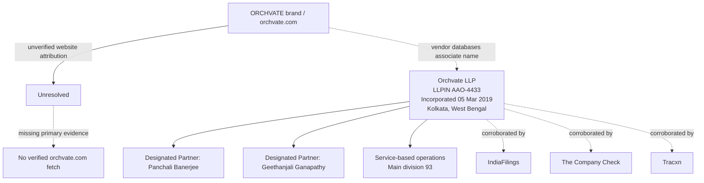

# Final Report

## Question

Investigate ORCHVATE as a company in India. Resolve the brand versus legal entity, distinguish similarly named companies, and use public or explicitly authorized information only. Cover identity, country of origin/incorporation/headquarters, operations, products/services, customers/partnerships, leadership, workforce and hiring signals, public social presence, recent developments, market context, risks, and unresolved questions. Known website/domain: https://orchvate.com. Recent-development period: last 12 months.

## Executive Summary

The strongest supported finding is that ORCHVATE in India corresponds to Orchvate LLP (LLPIN AAO-4433), an active LLP incorporated on 05 March 2019 and headquartered in Kolkata, West Bengal, with two designated partners named in vendor registry aggregators: Geethanjali Ganapathy and Panchali Banerjee [2][3]. Confidence is high on the legal-entity identity because three independent commercial registry aggregators corroborate the same LLPIN, incorporation date, address, and active status, even though they are not primary government records [1][2][3]. Confidence is low to medium on brand-to-website mapping and on operations, customers, hiring, and social presence because the supplied evidence did not successfully verify orchvate.com or any official company channels, and several Tracxn-based claims failed verification and were therefore excluded from the final assessment. The key open uncertainty is whether the Orchvate brand on orchvate.com is explicitly operated by Orchvate LLP and, if so, what specific products, services, and recent developments the company itself discloses.

## Architecture Diagram

## Entity Identity and Brand Resolution

The most defensible identity resolution is that ORCHVATE in India is Orchvate LLP, LLPIN AAO-4433, incorporated on 05 March 2019 and shown as active with ROC Kolkata jurisdiction [2][3]. Both IndiaFilings and The Company Check report the same registered office at 6/F Keyatala Road, Ground Floor, East, Kolkata, West Bengal 700029, while The Company Check also identifies the LLP as recognized by DPIIT and operating in the service-based segment [2][3]. These details are further corroborated by Tracxn, which also associates the brand name Orchvate with the LLP, but that page was not independently verified from a primary source in the supplied evidence [1].

However, the website/domain relationship is not resolved to the standard of this review. The supplied material references https://orchvate.com, but the site itself could not be fetched in the research run, so there is no reliable evidence here for the claim that orchvate.com explicitly states the legal name, ownership, or a brand/legal-entity mapping. That gap matters because the name “ORCHVATE” may be used as a brand, a legal entity name, or both, and the available evidence is sufficient only to tie the Indian LLP to the Orchvate name, not to prove the website’s current corporate attribution [1][2][3].

**Key Statistics**

- LLPIN AAO-4433 [2][3]
- Incorporated 05 March 2019 [2][3]
- Registered office: 6/F Keyatala Road, Ground Floor, East, Kolkata 700029 [2][3]
- Active status [2][3]
- 2 partners / 2 designated partners [3]

**Claims**

| # | Confidence | Source Agreement | Claim |
|---|---|---|---|
| 1 | High | Strong agreement | ORCHVATE in India is most likely Orchvate LLP, LLPIN AAO-4433, incorporated on 05 March 2019 and currently active. |
| 2 | High | Strong agreement | The registered office and headquarters are in Kolkata, West Bengal, India, at 6/F Keyatala Road, Ground Floor, East, Kolkata 700029. |
| 3 | Medium | Mixed | The brand name Orchvate is associated with the LLP in vendor registry databases, but the supplied evidence does not verify the current content of orchvate.com or prove the exact legal-to-brand relationship from the company’s own site. |

### Claim 1: ORCHVATE in India is most likely Orchvate LLP, LLPIN AAO-4433, incorporated on 0…

- **Confidence**: High
- **Source Agreement**: Strong agreement

**Supporting Evidence**

- IndiaFilings lists LLPIN AAO-4433, date of incorporation 05-03-2019, and LLP status Active [3].
- The Company Check lists LLPIN AAO-4433, incorporation 05 March 2019, and active status [2].
- Tracxn likewise identifies ORCHVATE LLP as an Indian LLP incorporated on Mar 05, 2019 [1].

### Claim 2: The registered office and headquarters are in Kolkata, West Bengal, India, at 6/…

- **Confidence**: High
- **Source Agreement**: Strong agreement

**Supporting Evidence**

- IndiaFilings gives the registered address as 6F, Keyatala Road, Ground Floor, East, Kolkata, West Bengal 700029 [3].
- The Company Check reports the same office location and describes HQ as Kolkata, West Bengal, India [2].
- Tracxn also lists the registered address in Kolkata, West Bengal, India [1].

### Claim 3: The brand name Orchvate is associated with the LLP in vendor registry databases,…

- **Confidence**: Medium
- **Source Agreement**: Mixed

**Supporting Evidence**

- Tracxn states that one brand associated with ORCHVATE LLP is Orchvate [1].
- The Company Check also reports that the LLP is associated with 1 brand: Orchvate [2].
- The orchvate.com website itself could not be successfully fetched in this research run, so no primary site-level confirmation is available in the supplied evidence.

## Operations, Products, and Market Positioning

The clearest operational clue in the supplied evidence is that IndiaFilings classifies the LLP under main division 93, “Other Service activities,” and The Company Check describes it as operating in the service-based operations segment [2][3]. Beyond that, the evidence base is thin and largely descriptive rather than transactional: no product catalog, service list, customer roster, case study, or partnership announcement was successfully verified from the company’s own materials in the supplied data. Tracxn adds a qualitative description—“Foundation focused on social enterprise building and running robust ecosystem for neurodivergent”—which suggests a social-enterprise or mission-led positioning, but that should be treated cautiously because it is vendor-authored and not corroborated by a primary Orchvate source in the record [1].

This means the firm’s market context can only be stated in broad terms. The service-sector classification places it in a very wide category that could cover consulting, community services, social programs, or related advisory activity, but the available evidence does not narrow that down. Any stronger claim about what Orchvate actually sells, whom it serves, or whether it operates as a foundation, nonprofit, or for-profit service provider would go beyond what the corroborated evidence supports [1][2][3].

**Key Statistics**

- Main division 93 [3]
- Service-based operations segment [2]

**Claims**

| # | Confidence | Source Agreement | Claim |
|---|---|---|---|
| 1 | High | Strong agreement | Orchvate LLP is classified in a service-based segment, with IndiaFilings listing main division 93, 'Other Service activities.' |
| 2 | High | Strong agreement | The supplied evidence does not substantiate a specific product catalog, customer list, or partnership network. |
| 3 | Medium | Mixed | Tracxn’s narrative suggests a social-enterprise orientation around neurodivergent communities, but this positioning is not independently confirmed by a primary Orchvate source in the supplied evidence. |

### Claim 1: Orchvate LLP is classified in a service-based segment, with IndiaFilings listing…

- **Confidence**: High
- **Source Agreement**: Strong agreement

**Supporting Evidence**

- IndiaFilings explicitly lists 'Main division of business activity to be carried out in India 93' and 'Description of main division Other Service activities' [3].
- The Company Check describes the LLP as operating in the service-based operations segment of the services sector [2].

### Claim 2: The supplied evidence does not substantiate a specific product catalog, customer…

- **Confidence**: High
- **Source Agreement**: Strong agreement

**Supporting Evidence**

- The memo contains no verified company-authored product pages, client announcements, or partnership disclosures.
- Vendor registry aggregators provide only high-level classification and entity metadata, not customer or product documentation [1][2][3].

### Claim 3: Tracxn’s narrative suggests a social-enterprise orientation around neurodivergen…

- **Confidence**: Medium
- **Source Agreement**: Mixed

**Supporting Evidence**

- Tracxn describes the company as a 'Foundation focused on social enterprise building and running robust ecosystem for neurodivergent' [1].
- No successfully verified company-owned page or filing in the supplied evidence repeats that description.
- Because the Tracxn page itself was not independently verifiable here, the description should be treated as a vendor-generated lead rather than a confirmed operating statement [1].

## Leadership, Workforce, and Hiring Signals

The strongest people-level evidence in the supplied record is the LLP’s formal governance structure: IndiaFilings lists two partners and two designated partners, and names Panchali Banerjee and Geethanjali Ganapathy [3]. The Company Check corroborates those same designated partners [2]. That is enough to establish a very small formal leadership footprint at the legal-entity level, but not enough to infer the broader organization size, employee count, or management team beyond those named partners.

The record does not contain verified hiring posts, employee directory data, or company-authored talent signals. Earlier Tracxn-derived comments about team size or scaling were excluded because they were not successfully verified in the evidence base and therefore cannot support conclusions about workforce scale. As a result, the prudent assessment is that Orchvate LLP has at least two named designated partners, while the rest of its workforce remains undocumented in the supplied public material [2][3].

**Key Statistics**

- 2 partners [3]
- 2 designated partners [3]

**Claims**

| # | Confidence | Source Agreement | Claim |
|---|---|---|---|
| 1 | High | Strong agreement | The LLP has two named designated partners: Panchali Banerjee and Geethanjali Ganapathy. |
| 2 | High | Strong agreement | No verified evidence in the supplied record supports a conclusion about employee count, team size, or hiring activity. |

### Claim 1: The LLP has two named designated partners: Panchali Banerjee and Geethanjali Gan…

- **Confidence**: High
- **Source Agreement**: Strong agreement

**Supporting Evidence**

- IndiaFilings names Panchali Banerjee and Geethanjali Ganapathy and lists 2 designated partners [3].
- The Company Check likewise identifies the LLP as led by designated partners Geethanjali Ganapathy and Panchali Banerjee [2].

### Claim 2: No verified evidence in the supplied record supports a conclusion about employee…

- **Confidence**: High
- **Source Agreement**: Strong agreement

**Supporting Evidence**

- The source set does not include verified job postings, workforce disclosures, or company-authored recruitment materials.
- Unsupported Tracxn-based workforce inferences were removed because the underlying page could not be verified in the evidence run [1].

## Public Presence, Social Channels, and Recent Developments

Public-facing presence is not well established in the supplied evidence. The record does not verify an official Orchvate social account, and no company-owned public channel was successfully authenticated from the information provided. The only contact-like data that appears in the source set is a Gmail address in IndiaFilings and generic vendor contact pages; those are not the same as a verified public social presence or an official communications strategy [2][3].

The recent-development window is also largely opaque. Although vendor databases sometimes surface time-stamped estimates or profile updates, the specific Tracxn-based FY2025 revenue and other recency-oriented claims were not treated as reliable because the source verification failed, and they are therefore excluded from the final evidentiary base. In practical terms, the supplied material does not support a defensible timeline of product launches, fundraising, partnerships, or organizational changes during the last 12 months [1][2][3].

**Key Statistics**

- No verified official social accounts identified
- No verified dated company announcements in the supplied evidence

**Claims**

| # | Confidence | Source Agreement | Claim |
|---|---|---|---|
| 1 | High | Strong agreement | The supplied evidence does not verify any official Orchvate social media account or company-owned public channel. |
| 2 | High | Strong agreement | The last-12-month development picture cannot be reliably reconstructed from the supplied evidence. |

### Claim 1: The supplied evidence does not verify any official Orchvate social media account…

- **Confidence**: High
- **Source Agreement**: Strong agreement

**Supporting Evidence**

- No successfully verified LinkedIn, X, Instagram, Facebook, YouTube, or other company-owned social profile is present in the supplied source set.
- The available sources are registry aggregators rather than authenticated company communications channels [1][2][3].

### Claim 2: The last-12-month development picture cannot be reliably reconstructed from the …

- **Confidence**: High
- **Source Agreement**: Strong agreement

**Supporting Evidence**

- The record contains no verified company press releases, filings, or social posts from the period.
- Tracxn-based recency claims were excluded after source-verification failure, leaving no dependable dated operational update [1].

## Risks, Confusion Points, and Unresolved Questions

The main risk is over-attribution: the brand Orchvate, the LLP Orchvate LLP, and the domain orchvate.com may all be connected, but the supplied evidence only securely proves the LLP identity and the association of the name Orchvate in vendor databases [1][2][3]. Because the company website could not be fetched, the review cannot confirm whether the website is operated by the LLP, whether it belongs to another legal entity, or whether it has changed ownership or messaging in the recent past. That leaves a material ambiguity for due diligence, brand protection, and compliance review.

A second risk is source quality. All usable evidence in this task comes from commercial registry aggregators rather than primary government filings or company-controlled disclosures, so the report can establish corroborated entity metadata but not high-confidence operating intelligence. Similarly named companies were not confirmed in the supplied evidence, and no defensible exclusion list can be built from the current record alone. The result is a narrow but solid core of identity facts, surrounded by unresolved questions about operations, website attribution, public channels, and any cross-border or similarly named entities that may exist [1][2][3].

**Key Statistics**

- 0 verified company-owned website pages in the supplied record
- 0 verified official social accounts in the supplied record

**Claims**

| # | Confidence | Source Agreement | Claim |
|---|---|---|---|
| 1 | High | Strong agreement | The relationship between the Orchvate brand, Orchvate LLP, and orchvate.com remains unresolved from the supplied evidence because the company site was not successfully verified. |
| 2 | Medium | Insufficient evidence | No similarly named non-India entity can be confidently ruled in or out from the supplied evidence. |
| 3 | High | Strong agreement | The chief diligence risk is confusing the brand name, the legal LLP, and the website domain without a primary source tying them together. |

### Claim 1: The relationship between the Orchvate brand, Orchvate LLP, and orchvate.com rema…

- **Confidence**: High
- **Source Agreement**: Strong agreement

**Supporting Evidence**

- The research run includes a fetch failure for https://www.orchvate.com/ with no content returned.
- None of the corroborated registry sources independently prove the website attribution from a company-owned page [1][2][3].

### Claim 2: No similarly named non-India entity can be confidently ruled in or out from the …

- **Confidence**: Medium
- **Source Agreement**: Insufficient evidence

**Supporting Evidence**

- The registry and aggregator sources provided here concern only the India LLP identity [1][2][3].
- The evidence base does not include a successful cross-jurisdiction name search or primary registry comparison for other countries.

### Claim 3: The chief diligence risk is confusing the brand name, the legal LLP, and the web…

- **Confidence**: High
- **Source Agreement**: Strong agreement

**Supporting Evidence**

- The LLP identity is corroborated, but the website itself is not verified in the supplied record.
- Vendor sources are sufficient for metadata but not for a definitive brand/domain ownership conclusion [1][2][3].

## Verification and Company Intelligence

- Registry outcome: no_match_in_completed_searches
- India registry outcomes:
  - MCA company and LLP master data: inconclusive_verification
  - Government Open Data India company master data catalog: inconclusive_verification
  - GST taxpayer search: inconclusive_verification
  - Udyam MSME verification: inconclusive_verification
  - Indian Trade Marks Registry public search: inconclusive_verification
### Identity Candidates

- {"candidate_name": "ORCHVATE", "confidence": "medium", "evidence": ["Target name appears in fetched source: Fetched content from https://tracxn.com/d/legal-entities/india/orchvate-llp/__nrTVcvejjdzdnl9LXCWEvL1c2Dhay2WTw_K6vz6ITn4"], "match_status": "possible_match", "retrieved_at": "2026-10-10T07:08:55.819098+00:00", "source_url": "https://tracxn.com/d/legal-entities/india/orchvate-llp/__nrTVcvejjdzdnl9LXCWEvL1c2Dhay2WTw_K6vz6ITn4", "verification_status": "candidate"}
- {"candidate_name": "ORCHVATE", "confidence": "medium", "evidence": ["Target name appears in fetched source: Fetched content from https://www.thecompanycheck.com/company/orchvate-llp/AAO-4433"], "match_status": "possible_match", "retrieved_at": "2026-10-10T07:08:57.296431+00:00", "source_url": "https://www.thecompanycheck.com/company/orchvate-llp/AAO-4433", "verification_status": "candidate"}
- {"candidate_name": "ORCHVATE", "confidence": "medium", "evidence": ["Target name appears in fetched source: Fetched content from https://www.indiafilings.com/search/orchvate-llp-AAO-4433"], "match_status": "possible_match", "retrieved_at": "2026-10-10T07:08:53.363728+00:00", "source_url": "https://www.indiafilings.com/search/orchvate-llp-AAO-4433", "verification_status": "candidate"}
- {"candidate_name": "ORCHVATE", "confidence": "medium", "evidence": ["Target name appears in fetched source: Fetched content from https://www.linkedin.com/shareArticle?mini=true&url=https%3A%2F%2Ftracxn.com%2Fd%2Flegal-entities%2Findia%2Forchvate-llp%2F__nrTVcvejjdzdnl9LXCWEvL1c2Dhay2WTw_K6vz6ITn4"], "match_status": "possible_match", "retrieved_at": "2026-10-10T07:09:05.758964+00:00", "source_url": "https://www.linkedin.com/shareArticle?mini=true&url=https%3A%2F%2Ftracxn.com%2Fd%2Flegal-entities%2Findia%2Forchvate-llp%2F__nrTVcvejjdzdnl9LXCWEvL1c2Dhay2WTw_K6vz6ITn4", "verification_status": "candidate"}
- {"candidate_name": "ORCHVATE", "confidence": "medium", "evidence": ["Target name appears in fetched source: Fetched content from https://www.facebook.com/sharer/sharer.php?u=https%3A%2F%2Ftracxn.com%2Fd%2Flegal-entities%2Findia%2Forchvate-llp%2F__nrTVcvejjdzdnl9LXCWEvL1c2Dhay2WTw_K6vz6ITn4"], "match_status": "possible_match", "retrieved_at": "2026-10-10T07:08:59.786042+00:00", "source_url": "https://www.facebook.com/sharer/sharer.php?u=https%3A%2F%2Ftracxn.com%2Fd%2Flegal-entities%2Findia%2Forchvate-llp%2F__nrTVcvejjdzdnl9LXCWEvL1c2Dhay2WTw_K6vz6ITn4", "verification_status": "candidate"}
### Roles

- {"confidence": "medium", "evidence": "[Corp Dev and M&A Teams](https://w.tracxn.com/customers/solutions-for-corporate-dev-and-ma-team)[Corporate Innovation](https://w.tracxn.com/customers/solutions-for-corporate-innovation)[Startup Founders](https://w.tracxn.com/customers/solutions-for-startup-founders)[Sales Team](https://w.tracxn.com/customers/sales-teams)", "person_name": "solutions-for-startup", "publication_date": null, "retrieved_at": "2026-10-10T07:08:55.819098+00:00", "role": "founder", "role_status": "current_claim", "source_url": "https://tracxn.com/d/legal-entities/india/orchvate-llp/__nrTVcvejjdzdnl9LXCWEvL1c2Dhay2WTw_K6vz6ITn4", "verification_status": "candidate"}
- {"confidence": "medium", "evidence": "* [Startup Founders](https://w.tracxn.com/customers/solutions-for-startup-founders)", "person_name": "solutions-for-startup", "publication_date": null, "retrieved_at": "2026-10-10T07:08:55.819098+00:00", "role": "founder", "role_status": "current_claim", "source_url": "https://tracxn.com/d/legal-entities/india/orchvate-llp/__nrTVcvejjdzdnl9LXCWEvL1c2Dhay2WTw_K6vz6ITn4", "verification_status": "candidate"}
- {"confidence": "medium", "evidence": "* Company details, directors and signatories", "person_name": "Company details", "publication_date": null, "retrieved_at": "2026-10-10T07:08:57.296431+00:00", "role": "director", "role_status": "current_claim", "source_url": "https://www.thecompanycheck.com/company/orchvate-llp/AAO-4433", "verification_status": "candidate"}
- {"confidence": "medium", "evidence": "Financials, compliance, directors, charges, ownership and filings for Orchvate LLP in one report.", "person_name": "compliance", "publication_date": null, "retrieved_at": "2026-10-10T07:08:57.296431+00:00", "role": "director", "role_status": "current_claim", "source_url": "https://www.thecompanycheck.com/company/orchvate-llp/AAO-4433", "verification_status": "candidate"}
- {"confidence": "medium", "evidence": "Financials, directors, compliance, charges and shareholding - compiled from official filings and updated regularly.", "person_name": "Financials", "publication_date": null, "retrieved_at": "2026-10-10T07:08:57.296431+00:00", "role": "director", "role_status": "current_claim", "source_url": "https://www.thecompanycheck.com/company/orchvate-llp/AAO-4433", "verification_status": "candidate"}
- {"confidence": "medium", "evidence": "One report that includes everything: company details, financials, directors, ownership, charges, legal cases and MCA filings. Pick the access that fits your workflow.", "person_name": "financials", "publication_date": null, "retrieved_at": "2026-10-10T07:08:57.296431+00:00", "role": "director", "role_status": "current_claim", "source_url": "https://www.thecompanycheck.com/company/orchvate-llp/AAO-4433", "verification_status": "candidate"}
- {"confidence": "medium", "evidence": "* [Company Directory](https://www.thecompanycheck.com/company-directory)", "person_name": "company", "publication_date": null, "retrieved_at": "2026-10-10T07:08:57.296431+00:00", "role": "director", "role_status": "current_claim", "source_url": "https://www.thecompanycheck.com/company/orchvate-llp/AAO-4433", "verification_status": "candidate"}
- {"confidence": "medium", "evidence": "* [Director Directory](https://www.thecompanycheck.com/director-directory)", "person_name": "director", "publication_date": null, "retrieved_at": "2026-10-10T07:08:57.296431+00:00", "role": "director", "role_status": "current_claim", "source_url": "https://www.thecompanycheck.com/company/orchvate-llp/AAO-4433", "verification_status": "candidate"}
### Dated Events

- {"confidence": "medium", "event_date": "2019", "event_type": "funded", "evidence": "|   [Orchvate](https://platform.tracxn.com/a/d/company/5c8a618978d8a023b5bb4267/orchvate \"Orchvate\")  | Foundation focused on social enterprise building and running robust ecosystem for neurodivergent  | 2019  | [India](https://tracxn.com/d/geographies/india/__ujYf3QI9FSnpS3x-zJCSwnay2nENQhm1kAN-U8-6Kfg)  | Unfunded  |", "publication_date": null, "retrieved_at": "2026-10-10T07:08:55.819098+00:00", "source_url": "https://tracxn.com/d/legal-entities/india/orchvate-llp/__nrTVcvejjdzdnl9LXCWEvL1c2Dhay2WTw_K6vz6ITn4", "verification_status": "candidate"}
### Public Business Contacts

- {"confidence": "medium", "contact_type": "email", "evidence": "Published on fetched page: hi@tracxn.com", "publication_date": null, "retrieved_at": "2026-10-10T07:08:55.819098+00:00", "source_url": "https://tracxn.com/d/legal-entities/india/orchvate-llp/__nrTVcvejjdzdnl9LXCWEvL1c2Dhay2WTw_K6vz6ITn4", "value": "hi@tracxn.com", "verification_status": "published_unverified"}
- {"confidence": "medium", "contact_type": "channel", "evidence": "Published contact channel link: https://tracxn.com/contactus", "publication_date": null, "retrieved_at": "2026-10-10T07:08:55.819098+00:00", "source_url": "https://tracxn.com/d/legal-entities/india/orchvate-llp/__nrTVcvejjdzdnl9LXCWEvL1c2Dhay2WTw_K6vz6ITn4", "value": "https://tracxn.com/contactus", "verification_status": "published_unverified"}
- {"confidence": "medium", "contact_type": "channel", "evidence": "Published contact channel link: https://www.thecompanycheck.com/contact-us", "publication_date": null, "retrieved_at": "2026-10-10T07:08:57.296431+00:00", "source_url": "https://www.thecompanycheck.com/company/orchvate-llp/AAO-4433", "value": "https://www.thecompanycheck.com/contact-us", "verification_status": "published_unverified"}
- {"confidence": "medium", "contact_type": "channel", "evidence": "Published contact channel link: https://api.whatsapp.com/send?text=Orchvate%20LLP%20-%20LLP%20Profile%20%26%20Partners%20%7C%20The%20Company%20Check%20https%3A%2F%2Fwww.thecompanycheck.com%2Fcompany%2Forchvate-llp%2FAAO-4433", "publication_date": null, "retrieved_at": "2026-10-10T07:08:57.296431+00:00", "source_url": "https://www.thecompanycheck.com/company/orchvate-llp/AAO-4433", "value": "https://api.whatsapp.com/send?text=Orchvate%20LLP%20-%20LLP%20Profile%20%26%20Partners%20%7C%20The%20Company%20Check%20https%3A%2F%2Fwww.thecompanycheck.com%2Fcompany%2Forchvate-llp%2FAAO-4433", "verification_status": "published_unverified"}
- {"confidence": "medium", "contact_type": "email", "evidence": "Published on fetched page: banerjeepanchali2@gmail.com", "publication_date": null, "retrieved_at": "2026-10-10T07:08:53.363728+00:00", "source_url": "https://www.indiafilings.com/search/orchvate-llp-AAO-4433", "value": "banerjeepanchali2@gmail.com", "verification_status": "published_unverified"}
- {"confidence": "medium", "contact_type": "channel", "evidence": "Published contact channel link: https://www.indiafilings.com/contact-us", "publication_date": null, "retrieved_at": "2026-10-10T07:08:53.363728+00:00", "source_url": "https://www.indiafilings.com/search/orchvate-llp-AAO-4433", "value": "https://www.indiafilings.com/contact-us", "verification_status": "published_unverified"}

## Run Status and Failure Records

- Run status: partial
### Search failures

- {"attempt": 1, "provider": "ddgs_search", "query": "ORCHVATE India company legal entity", "result_count": 5, "retryable": false, "status": "success"}
- {"attempt": 1, "provider": "ddgs_search", "query": "site:orchvate.com ORCHVATE India about legal name", "reason": "timeout", "retryable": true, "status": "failed"}
- {"attempt": 2, "provider": "ddgs_search", "query": "site:orchvate.com ORCHVATE India about legal name", "reason": "timeout", "retryable": false, "status": "failed"}
- {"attempt": 1, "provider": "ddgs_search", "query": "orchvate.com company registration India", "reason": "timeout", "retryable": true, "status": "failed"}
- {"attempt": 2, "provider": "ddgs_search", "query": "orchvate.com company registration India", "reason": "timeout", "retryable": false, "status": "failed"}
- {"attempt": 1, "provider": "ddgs_search", "query": "ORCHVATE LLP Pvt Ltd India", "reason": "timeout", "retryable": true, "status": "failed"}
- {"attempt": 2, "provider": "ddgs_search", "query": "ORCHVATE LLP Pvt Ltd India", "reason": "timeout", "retryable": false, "status": "failed"}
- {"attempt": 1, "provider": "ddgs_search", "query": "site:orchvate.com services ORCHVATE", "reason": "timeout", "retryable": true, "status": "failed"}
- {"attempt": 2, "provider": "ddgs_search", "query": "site:orchvate.com services ORCHVATE", "result_count": 5, "retryable": false, "status": "success"}
### Fetch failures

- {"failure_type": "timeout", "reason": "fetch timed out", "url": "https://www.companydetails.in/company/orchvate-llp"}
- {"failure_type": "backend_or_blocked", "reason": "no content returned", "retrieved_at": "2026-10-09T20:31:35.881873+00:00", "url": "https://www.orchvate.com/"}

## Recommendations

- Legal/compliance teams should verify Orchvate LLP directly in the MCA master data and GST/Udyam portals using LLPIN AAO-4433 and GSTIN 19AAGFO3742B1ZG before relying on any vendor profile, because registry aggregators may be stale or incomplete [2][3].
- The Orchvate management team should publish an official 'About' or legal notice page on orchvate.com that states the exact legal entity, registered office, and designated partners, because the current evidence base cannot confirm website-to-entity attribution from the company’s own source.
- Partnership and procurement teams should ask Orchvate for a current corporate deck, signed engagement letter, or invoice header that identifies the contracting entity, because the public record does not yet establish what products or services the company actually sells.
- Investors, counterparties, and analysts should treat any workforce or revenue estimates from vendor databases as provisional until corroborated by filings or company disclosures, because the verified evidence supports only entity metadata and a small governance structure.
- Researchers should perform a targeted follow-up on orchvate.com and authenticated social profiles, because those are the missing primary sources needed to resolve the brand, operations, and recent-development questions.

## Methodology & Confidence

### Methodology

This report is based on 3 corroborating vendor registry/aggregate sources for the target entity and 1 general vendor homepage reference, all supplied in the user prompt. The date range of source retrieval in the research run is 10 Oct 2026 for the fetched pages, while the underlying company facts refer to incorporation in March 2019 and status/metadata current as of the vendor snapshots. The evidence base is limited by the absence of verified primary government filings, by a failed fetch of orchvate.com, and by excluded Tracxn-based claims that could not be independently verified in the research run. No authenticated company-owned social profiles, press releases, or recent filings were available in the supplied material, so conclusions about operations, customers, hiring, and last-12-month developments remain constrained.

### Overall Confidence

High-confidence conclusions: Orchvate LLP is the likely Indian legal entity behind the ORCHVATE name; it is active, Kolkata-based, incorporated on 05 March 2019, and associated with two designated partners named in two independent vendor registries [2][3]. Medium-confidence conclusions: the brand name Orchvate is associated with that LLP in vendor databases, and the LLP is service-oriented under a broad 'Other Service activities' classification [1][2][3]. Low-confidence or unresolved areas: whether orchvate.com is controlled by Orchvate LLP, what the company specifically sells, who its customers or partners are, whether it has an official social presence, and what changed in the last 12 months. The assessment would change materially if a company-owned website page, MCA/GST/Udyam record, trademark filing, or verified social profile explicitly tied the brand/domain to Orchvate LLP and disclosed operations or recent announcements.

## Open Questions

- Does orchvate.com explicitly name Orchvate LLP as the operating entity, and if so on which page and since when?
- Are there authenticated Orchvate social media profiles, and do they link back to the LLP or to a different legal entity?
- What are Orchvate’s actual products or services beyond the broad 'Other Service activities' classification?
- Who are the company’s customers, partners, or beneficiaries, if any, and are there public case studies or testimonials?
- What has changed at Orchvate in the last 12 months according to company-controlled or government sources?
- Are there any similarly named entities in India or abroad that could cause confusion, and how should they be distinguished?
- Is Orchvate LLP operating any foundation, nonprofit program, or social-enterprise arm, and what is its legal structure?

## Sources

[1] ORCHVATE LLP - Company Profile — https://tracxn.com/d/legal-entities/india/orchvate-llp/__nrTVcvejjdzdnl9LXCWEvL1c2Dhay2WTw_K6vz6ITn4
[2] Orchvate LLP [AAO-4433] | The Company Check — https://www.thecompanycheck.com/company/orchvate-llp/AAO-4433
[3] ORCHVATE LLP — https://www.indiafilings.com/search/orchvate-llp-AAO-4433

## Report Notes

- Claims are separated from evidence so reviewers can inspect support independently.
- Confidence reflects strength and completeness of available evidence.
- Source Agreement reflects whether cited sources align, conflict, or remain too sparse.